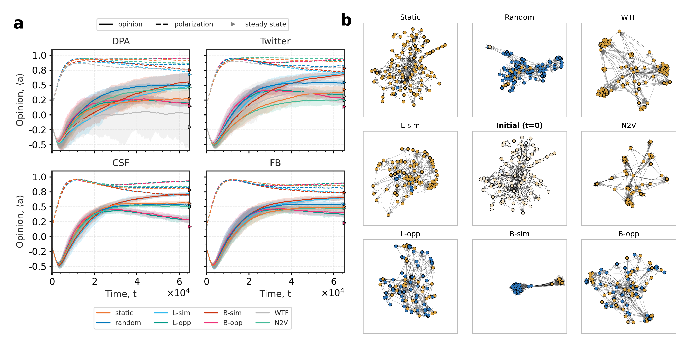

# *Guided rewiring of social networks reduces polarization and accelerates consensus*

by
Jordan P. Everall,
Lilli Frei,
Andrew K. Ringsmuth


This paper has been submitted for publication in PNAS Nexus (revised following a major revisions decision, 2026).

In this project, we use an agent based model where agents are embedded in a social network to analyse the effect of different rewiring strategies on the speed and magnitude of consensus formation, and depolarization in social groups. We are interested in these dynamics because socio-political polarization is a major barrier to collective action problems such as climate change, which must urgently be addressed. We investigate the effect of rewiring algorithms based on widely used recommender algorithms such as Who to Follow and node2vec. We find that building lasting links between polarized individuals and communities can accelerate consensus formation when the sociopolitical environment is favourable, even taking into account backfiring interactions between agents. This strengthens the evidence that promoting connection between polarized communities could accelerate collective action on urgent global challenges. 
&nbsp; 
|  |
|:--:| 
| *Comparing network evolutions for all rewiring algorithms* |


## Software implementation


All source code used to generate the results and figures in the paper are in
the `Analysis` folder. The model itself is contained in `models_checks.py`; `run_phased.py` runs the
main campaign. Parameter sweeps and sensitivity analyses are run by `general_param_sweep.py` and
`trajectory_sweep.py`. Results generated by the code are saved in `Output`, figures in `Figs`, and
plotting and statistics scripts live in `Analysis/Plotting` and `Analysis/Stats`.

## Structure

```
.
├── Analysis                 # model, sweeps, extraction
│   ├── Plotting             # figure scripts
│   └── Stats                # statistics scripts
├── Auxillary                # rewiring helpers, node2vec
├── Figs                     # generated figures
├── Output                   # generated results
└── Pre_processing
    └── networks_processed   # empirical Facebook and Twitter topologies
```


## Getting the code

You can download a copy of all the files in this repository by cloning the
[git](https://git-scm.com/) repository:

    git clone https://github.com/lifrei/Rewiring-Collective-Action.git

or [download a zip archive](https://github.com/lifrei/Rewiring-Collective-Action/archive/refs/heads/main.zip).


## Dependencies

You'll need a working Python environment to run the code.
The recommended way to set up your environment is through the
[Anaconda Python distribution](https://www.anaconda.com/download/) which
provides the `conda` package manager.
Anaconda can be installed in your user directory and does not interfere with
the system Python installation.
The required dependencies are specified in the file `environment.yaml`, as well as `requirements.txt` .

We use `conda` virtual environments to manage the project dependencies in
isolation.
Thus, you can install our dependencies without causing conflicts with your
setup (even with different Python versions).

Run the following command in the repository folder (where `environment.yml`
is located) to create a separate environment and install all required
dependencies in it:

    conda env create

For Debian clusters where conda is unavailable, a `uv`-based setup guide is provided in `UV_SETUP_GUIDE.md`.

### node2vec

The `node2vec` rewiring algorithm calls the C++ reference implementation from SNAP, which is not
redistributed here. Build it from
[snap-stanford/snap](https://github.com/snap-stanford/snap/tree/master/examples/node2vec) and place
the resulting binary in `Auxillary/` as `node2vec` (Linux/macOS) or `node2vec.exe` (Windows). The
other rewiring algorithms run without it.


## Reproducing the results

Before running any code you must activate the conda environment:

    source activate ENVIRONMENT_NAME

or, if you're on Windows:

    activate ENVIRONMENT_NAME

This will enable the environment for your current terminal session.
Any subsequent commands will use software that is installed in the environment.

The main simulation campaign, the parameter sweeps, the figures and the statistics are then run
from their respective folders:

    cd Analysis && python run_phased.py
    cd Analysis && python general_param_sweep.py
    cd Analysis/Plotting && python <plot_script>.py
    cd Analysis/Stats && python <stats_script>.py

Simulations are parallelised over CPU cores and the full campaign takes on the order of days on a
workstation; individual figure and statistics scripts read the saved CSVs in `Output` and run in
minutes.

The result CSVs in `Output` and the generated figures in `Figs` are not included in this repository
or the archived release: the main campaign alone runs to tens of gigabytes. The scripts regenerate
them from scratch. The empirical Facebook and Twitter topologies used as model input *are* included,
in `Pre_processing/networks_processed`.


## License

All source code is made available under a BSD 3-clause license. You can freely
use and modify the code, without warranty, so long as you provide attribution
to the authors. See `License.md` for the full license text.

The manuscript text is not open source. The authors reserve the rights to the
article content, which is currently submitted for publication in PNAS Nexus.
